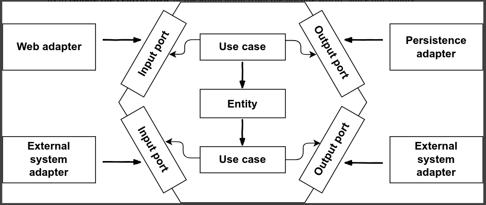

# Kiến trúc lục giác (Hexagonal Architecture)

Giới thiệu về kiến trúc lục giác
_Lược dịch từ: https://www.educative.io/blog/hexagonal-architecture-tutorial_

Để xây dựng một ứng dụng đủ độ phức tạp cần bắt đầu từ thiết kế, kiến trúc phù hợp. Mục đích của kiến trúc phần mềm là để tạo ra các ứng dụng dễ bảo trì, có thể mở rộng để thích ứng với các thay đổi tương lai - điều này đặc biệt đúng cho các ứng dụng web.

Kiến trúc lục giác là một mẫu kiến trúc phổ biến trong phát triển phần mềm. Phong cách kiến trúc này thúc đẩy việc phân tách các mối quan tâm bằng cách đặt logic vào các lớp khác nhau của ứng dụng.

## Kiến trúc lục giác là gì?

Tên gọi khác phản ánh bản chất của kiến trúc này hơn là "kiến trúc dựa trên các cổng và bộ điều hợp" (ports and adapters architecture). Nó bắt nguồn từ nghiên cứu của Alistair Cockburn năm 2005. Chúc ta đặt các lối vào, ra của ứng dụng ở rìa của hình lục giác. Điều này cho phép cách ly logic trung tâm của ứng dụng với thế giới bên ngoài (luôn biến động). Vì lối vào và lối ra ở rìa nên chúng ta có thể dễ dàng chuyển đổi các bộ xử lý mà không ảnh hưởng tới logic hoạt động cốt lõi của ứng dụng.

Mục đích của kiến trúc này nhằm tăng khả năng bảo trì của ứng dụng. Kiến trúc lục giác được thể hiện bằng một hình lục giác, mỗi cạnh khác nhau của hình này đại diện cho các cách giao tiếp với hệ thống bên ngoài. Ví dụ, chúng ta có thể giao tiếp qua các giao thức HTTP, REST API, SQL ... Mỗi lớp của hình lục giác độc lập với các lớp khác, vì vậy chúng ta có thể thực hiện các thay đổi riêng lẻ mà không ảnh hưởng tới toàn bộ hệ thống.

Hình dưới đây thể hiện một kiến trúc lục giác điển hình cho ứng dụng web:

_Kiến trúc lục giác điển hình cho một ứng dụng web._

Lớp ứng dụng được biểu diễn dưới dạng hình lục giác. Trong hình lục giác, ta có các _thực thể_/_entities_ miền và các _trường hợp sử dụng_/_use cases_. Không có sự phụ thuộc theo hướng đi ra bên ngoài trong thiết kế này. Tất cả các phụ thuộc đều hướng về trung tâm. Trong lõi hình lục giác, hoặc miền/lĩnh vực/domain, không phụ thuộc gì ngoài chính nó. Điều này đảm bảo rằng logic nghiệp vụ được tách biệt khỏi các lớp kỹ thuật. Nó cũng đảm bảo rằng chúng ta có thể tái sử dụng lại các logic nghiệp vụ. Nếu chúng ta thay đổi chồng công nghệ sử dụng, nó cũng không ảnh hưởng đến mã bên trong lớp logic nghiệp vụ/lĩnh vực (domain code). Lõi của kiến trúc này chứa logic và quy tắc nghiệp vụ chính yếu.

Bên ngoài hình lục giác, ta thấy các bộ điều hợp (adapters) khác nhau tương tác với ứng dụng của ta. Các bộ điều hợp sẽ tương tác với các khía cạnh khác nhau của ứng dụng. Ví dụ, chúng ta có thể có bộ điều hợp web tương tác với trình duyệt web, một số bộ điều hợp tương tác với hệ thống bên ngoài, và một bộ điều hợp tương tác với cơ sở dữ liệu. Các bộ điều hợp ở phía bên phải hình vẽ được điều khiển bởi ứng dụng vì chúng được gọi bởi lõi của ứng dụng (thông qua các cổng lối ra - ouput ports).

Bộ điều hợp có thể là các APIs bên ngoài hoặc ứng dụng khách đối với hệ thống của bạn. Bộ điều hợp tương tác với ứng dụng thông qua các cổng. Lõi ứng dụng cung cấp các cổng để nó có thể giao tiếp với các bộ điều hợp (adapters). Các cổng này cho phép chúng ta cắm các bộ điều hợp vào miền lõi.

**Lưu ý**: Kiến trúc lục giác (hay kiến trúc phần mềm nói chung) không phụ thuộc vào bất kỳ khung kỹ thuật/framework nào.

## Lợi ích so với kiến trúc lớp

Kiến trúc lục giác khác biệt so với kiến trúc lớp truyền thống. Một trong các khác biệt chính của kiến trúc lục giác là các giao diện người dùng (UI) có thể được hoán đổi cho nhau. Có nhiều các lợi ích khác nữa. Dưới đây liệt kê một số ưu, nhược điểm, và trường hợp sử dụng của kiến trúc này:

**Ưu**

- Khả năng bảo trì: Dễ dàng bảo trì vì thay đổi ở khu vực này không ảnh hưởng đến khu vực khác trong ứng dụng.
- Tính tùy biến: Chúng ta có thể dễ dàng chuyển đổi giữa các ứng dụng bên ngoài khác nhau bằng cách thêm vào các bộ điều hợp mà không cần thay đổi mã nguồn.
- Dễ dàng kiểm thử: vì mã của chúng ta được phân tách với các chi tiết triển khai cụ thể bên ngoài, nên chúng ta có thể dễ dàng viết mã kiểm thử phần mềm.
- Bất biết: Vì ứng dụng độc lập với các dịch vụ bên ngoài nên chúng ta có thể phát triển phần lõi bên trong trước khi xây dựng các dịch vụ bên ngoài.

**Nhược**

- Hiệu suất: do việc phân cách/tách rời/decoupling các lớp, nên hiệu suất hoạt động của ứng dụng có thể bị ảnh hưởng bởi các lớp trung gian.
- Gỡ lỗi: Đôi khi có thể gây khó hiểu và gỡ lỗi các bộ điều hợp.
- Phức tạp: Kiến trúc lục giác đôi khi có thể gây ra các nhầm lẫn / hiểu lầm vì không phải lúc nào chúng ta cũng thấy rõ được những phần mà chúng ta xem như là ở bên ngoài.

**Trường hợp sử dụng**

- Ứng dụng ngân hàng: cho phép người dùng gửi tiền từ tài khoản này sang tài khoản khác
- Ứng dụng vay tiền: cho phép người dùng đăng ký khoản vay, thực hiện các bước xác minh và nhật bản cập nhật khi ứng dụng cập nhật.
- Ứng dụng khách hàng thân thiết: người dùng đăng ký khách hàng, có thể nâng cấp hoặc hạ cấp tư cách thành viên của họ.

## Các nguyên tắc trong ứng dụng lục giác

**Nguyên tắc đơn trách nhiệm (SRP)** "Mỗi thành phần phần mềm chỉ nên có một lý do để thay đổi". Trong kiến trúc này, nếu một thành phần chỉ có một lý do để thay đổi, thì chúng ta không phải lo lắng về nó khi thay đổi các thành phần khác (vì các lý do khác).

**Đảo ngược phụ thuộc (DIP)**
