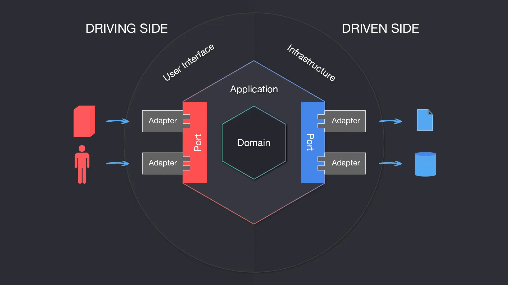

## Giới thiệu

- Càng tìm hiểu về các mẫu thiết kế sâu mình càng nghĩ kỹ về kiến trúc phần mềm (ở mức cao hơn tư duy mẫu thiết kế cụ thể)
- Kiến trúc lục giác bắt đầu từ lõi (bussiness logic) bên trong rồi xây dựng các bộ "điều hợp" (adapter) và các "cổng" (ports) để kết nối với các thành phần bên ngoài ở lớp ngoài cùng.
- Việc tư duy từ lõi logic công việc (hay logic ứng dụng) có thể áp dụng cho bất kỳ dự án nào có mức độ logic phức tạp nhất định (không còn đơn giản như bật tắt LED, điều khiển mô-tơ nữa). Ngay cả các dự án phầm mềm nhúng (firmware cho các con vi điều khiển) cũng nên bắt đầu thiết kế theo kiểu này.
- Kiến trúc điều hợp/cổng (hexagonal) có thể là xuất phát điểm để xây dựng bất kỳ loại phần mềm nào. Sự phụ thuộc của lớp bên ngoài vào bên trong, giúp cho có thể xây dựng logic công việc trước và không phụ thuộc vào phần cứng hay dịch vụ bên ngoài (API). Có thể ghép nối các mã giả lập (API, sensors) cho các dịch vụ bên ngoài để kiểm thử lõi logic công việc được xây dựng trước.
- Xây dựng phần mềm từ trong ra ngoài là một loại kiến trúc rất mạnh mẽ và hữu ích.
- Cần tìm hiểu kỹ hơn về kiến trúc này.

Bài viết sau đây lược dịch từ [Pablo Martinez's Hexagonal Architecture, there are always two sides to every story](https://medium.com/ssense-tech/hexagonal-architecture-there-are-always-two-sides-to-every-story-bc0780ed7d9c)

# Kiến trúc lục giác, hai mặt của mọi câu chuyện

Mục tiêu của Kiến trúc phân lớp truyền thống là tách biệt một ứng dụng thành các tầng khác nhau, trong đó mỗi tầng chứa các mô-đun và lớp có trách nhiệm chung hoặc tương tự nhau và làm việc cùng nhau để thực hiện các tác vụ cụ thể.

Có nhiều biến thể khác nhau của Kiến trúc phân lớp (layered architecture) và không có quy tắc nào xác định có bao nhiêu lớp nên tồn tại. Mẫu phổ biến nhất là kiến trúc 3 tầng, trong đó ứng dụng được chia thành Lớp trình bày, Lớp logic, và Lớp dữ liệu.

Trong cuốn sách của mình, Domain-Driven Design: Tackling Complexity in the Heart of Software, Eric Evans đề xuất một kiến trúc 4 tầng để cho phép cách ly giữa Lớp miền chứa logic nghiệp vụ và 3 lớp hỗ trợ khác: Giao diện người dùng (UI), Ứng dụng (Application), và Cơ sở hạ tầng (Infrastructure).

Kiến trúc phân lớp có lợi theo nhiều cách, một và quan trọng nhất là tách biệt các mối quan tâm. Tuy nhiên, luôn có rủi ro. Vì không có cơ chế tự nhiên nào để phát hiện khi rò rỉ logic giữa các lớp, người ta có thể — và có thể sẽ — kết thúc bằng việc rải rác logic nghiệp vụ trong giao diện người dùng hoặc mối quan tâm về Cơ sở hạ tầng lẫn lộn trong logic nghiệp vụ.

Vào năm 2005, Alistair Cockburn nhận ra rằng không có nhiều sự khác biệt giữa cách giao diện người dùng và cơ sở dữ liệu tương tác với một ứng dụng, vì chúng đều là những tác nhân bên ngoài có thể hoán đổi cho nhau bằng các thành phần tương tự, theo những cách tương đương, sẽ tương tác với một ứng dụng. Bằng cách nhìn mọi thứ theo cách này, người ta có thể tập trung vào việc giữ cho ứng dụng không tin tưởng vào các tác nhân “bên ngoài” này, cho phép chúng tương tác thông qua Cổng và Bộ điều hợp (Ports and Adapters), do đó tránh được sự vướng víu và rò rỉ logic giữa logic nghiệp vụ và các thành phần bên ngoài.

Trong bài viết này, tôi sẽ cố gắng hướng dẫn bạn các khái niệm chính về Kiến trúc hình lục giác, lợi ích và lưu ý của nó, đồng thời mô tả một cách đơn giản cách bạn có thể thu lợi từ mô hình này trong các dự án của mình.

_Tương tác người dùng, ứng dụng, và dữ liệu, nhìn sơ lược._

Kiến trúc hình lục giác hay còn gọi là Cổng và Bộ điều hợp (Ports and Adapters), là một mẫu kiến trúc cho phép đầu vào của người dùng hoặc hệ thống bên ngoài đến ứng dụng thông qua Các bộ điều hợp ở các Cổng, và cho phép ứng dụng gửi dữ liệu ra cũng thông qua Cổng và các Bộ điều hợp (xem hình bên dưới). Điều này tạo ra một lớp trừu tượng (abstraction layer) bảo vệ lõi ứng dụng và cách ly nó khỏi các công cụ và công nghệ (không liên quan lắm) bên ngoài.

## Cổng (Ports)

Chúng ta có thể xem Cổng là một điểm vào bất khả tri về công nghệ, nó xác định giao diện cho phép các tác nhân nước ngoài giao tiếp với Ứng dụng, bất kể ai hoặc cái gì sẽ triển khai giao diện nói trên. Giống như cổng USB cho phép nhiều loại thiết bị giao tiếp với máy tính miễn là chúng có bộ điều hợp USB. Các cổng cũng cho phép Ứng dụng giao tiếp với các hệ thống hoặc dịch vụ bên ngoài, chẳng hạn như cơ sở dữ liệu, trình môi giới tin nhắn, các ứng dụng khác, v.v.

> Bí quyết: Cổng (Ports) luôn có hai thứ được nối với nó, một trong hai luôn dùng để kết nối thử nghiệm

## Bộ điều hợp (Adapters)

Bộ điều hợp sẽ bắt đầu tương tác với Ứng dụng thông qua Cổng, sử dụng một công nghệ cụ thể, ví dụ: bộ điều khiển REST sẽ đại diện cho bộ điều hợp cho phép máy khách giao tiếp với Ứng dụng. Có thể có nhiều Bộ điều hợp cho bất kỳ Cổng nào nếu cần mà không gây rủi ro cho chính Cổng hoặc Ứng dụng.

_Ứng dụng tương tác với bên ngoài qua Cổng và Bộ điều hợp._

## Ứng dụng (Application)

Ứng dụng là cốt lõi của hệ thống, nó chứa các Dịch vụ Ứng dụng (Application Services) điều phối chức năng (functionality) hoặc các trường hợp sử dụng (use cases). Nó cũng chứa Mô hình miền (Domain Model), chính là logic nghiệp vụ được nhúng trong các Kết tập (Aggregates), Thực thể (Entities) và Đối tượng Giá trị (Value Objects). Ứng dụng được biểu thị bằng một hình lục giác nhận lệnh hoặc truy vấn từ Cổng và gửi yêu cầu đến các tác nhân bên ngoài khác, chẳng hạn như cơ sở dữ liệu, thông qua Cổng.

Khi được ghép nối với Thiết kế hướng miền (DDD), Ứng dụng, hoặc Hình lục giác, chứa cả lớp Ứng dụng (Application layers) và miền (Domain layers), để lại các lớp Giao diện người dùng (UI layers) và Cơ sở hạ tầng (Infrastructure layers) bên ngoài.

_DDD trong kiến trúc lục giác: Domain và Ứng dụng, UI, Hạ tầng_

## Tại sao lại Hexagon?

Ý tưởng của Alistair về việc sử dụng Hexagon chỉ đơn thuần là để có một biểu diễn trực quan về nhiều kết hợp Cổng/Bộ điều hợp mà một ứng dụng có thể có và cũng để mô tả cách phía bên trái của ứng dụng ("phía lái" - driving side), có các tương tác và cách triển khai khác nhau so với phía bên phải ("phía bị lái" - driven side).

## Phía lái và Phía bị lái

Các tác nhân lái (hoặc chính) là phía khởi tạo tương tác và được đặt ở phía bên trái sơ đồ. Ví dụ: Bộ điều hợp lái
có thể là bộ điều khiển nhận dữ liệu đầu vào (người dùng) và chuyển nó đến Ứng dụng thông qua Cổng.

Các tác nhân bị lái (hoặc phụ) là những tác nhân được Ứng dụng “kích hoạt hành vi”. Ví dụ: một Bộ điều hợp cơ sở dữ liệu được gọi bởi Ứng dụng để nó tìm nạp một tập dữ liệu nhất định từ bộ lưu trữ lâu dài (persistence).

Khi nói đến việc triển khai, có một số chi tiết quan trọng không nên bỏ qua:

- Các Cổng (Ports) sẽ được biểu diễn bằng các giao diện trong ngôn ngữ lập trình (tùy ngôn ngữ lập trình, có thể là interface hoặc abstract class).
- Bộ điều hợp lái (Driving Adapters) sử dụng Cổng và Dịch vụ ứng dụng sẽ triển khai Giao diện do Cổng xác định (như nói ở điểm trên). Trong trường hợp này, cả giao diện và mã triển khai của Cổng đều nằm bên trong hình lục giác.
- Bộ điều hợp bị lái sẽ triển khai Cổng và Dịch vụ ứng dụng. Trong trường hợp này Cổng nằm trong hình lục giác, nhưng việc triển khai nằm trong Bộ điều hợp, do đó nằm ngoài hình lục giác.

_Phía Lái và phía Bị Lái trong kiến trúc lục giác._

## Đảo ngược phụ thuộc trong Kiến trúc lục giác

Nguyên tắc đảo ngược phụ thuộc là một trong 5 nguyên tắc do ("ông Chú") Bob Martin đặt ra trong bài báo "OO Design Quality Metrics" và sau đó trong cuốn sách "Agile Software Development Principles, Patterns and Practices", trong đó ông định nghĩa nó như sau:

- Các mô-đun cấp cao không nên phụ thuộc vào các mô-đun cấp thấp. Cả hai nên phụ thuộc vào trừu tượng.
- Trừu tượng không nên phụ thuộc vào chi tiết. Chi tiết nên phụ thuộc vào trừu tượng.

Như đã đề cập, bên trái và bên phải của Hình lục giác là 2 loại tác nhân khác nhau, Lái và Bị lái đều có cả Cổng và Bộ điều hợp.

Về phía Lái, Bộ điều hợp phụ thuộc vào (uses) Cổng, được Dịch vụ ứng dụng (Application Service) triển khai (implements), do đó Bộ điều hợp không biết ai sẽ hồi đáp các yêu cầu của nó, nó chỉ biết những phương thức khả dụng, do đó, nó phụ thuộc vào một sự trừu tượng hóa (Cổng).

Về phía Bị Lái, Dịch vụ ứng dụng là dịch vụ phụ thuộc vào (uses) Cổng và Bộ điều hợp thì triển khai (implements) Giao diện của Cổng. Việc này nhằm đạt được đảo ngược phụ thuộc do bbộ điều hợp 'cấp thấp' (tức là kho lưu trữ cơ sở dữ liệu) buộc phải triển khai sự trừu tượng được xác định trong lõi của ứng dụng, đó là 'cấp độ cao hơn' (thông qua Bộ điều hợp).

## Tại sao ta nên sử dụng Cổng và Bộ điều hợp?

Có nhiều ưu điểm khi sử dụng Kiến trúc Cổng và Bộ điều hợp (tên gọi bản chất của Kiến trúc Lục giác), một trong số đó là giúp ta cách ly hoàn toàn logic ứng dụng, logic miền theo cách hoàn toàn có thể kiểm thử được. Vì nó không phụ thuộc vào các yếu tố bên ngoài, nên việc thử nghiệm nó trở nên tự nhiên và nhại lại (giả lập - mocking) các thành phần phụ thuộc bên ngoài này rất dễ dàng.

Nó cũng cho phép bạn thiết kế tất cả các `giao diện` của hệ thống (system's interfaces) **theo mục đích** chứ không phải **theo công nghệ**, giúp bạn không bị khóa cứng vào công nghệ đã chọn, và giúp ngăn xếp công nghệ của bạn có thể tiến hóa/thay đổi theo thời gian. Ví dụ bạn muốn thay đổi lớp Lưu trữ Cơ sở dữ liệu, chỉ cần viết một bộ điều hợp mới.

Kiến trúc Cổng và Bộ điều hợp cũng hoạt động rất tốt với Thiết kế hướng miền (Domain-Driven Design). Ưu điểm chính mà nó mang lại là nó bảo vệ logic miền không bị "rò rỉ" ra khỏi lõi ứng dụng của bạn. Chỉ cần lưu tâm tới sự rò rỉ giữa các lớp Ứng dụng và Miền.

## Ví dụ về cấu trúc và mã cụ thể của một ứng dụng sử dụng kiến trúc lục giác

Trong phần này, ta sẽ xây dựng một phiên bản đơn giản hóa của dịch vụ xử lý các yêu cầu tạo đơn đặt hàng cho một dịch vụ thương mại điện tử.

Lưu ý, ví dụ này bỏ qua một số chi tiết mà chỉ tập trung vào minh họa các khái niểm triển khai Cổng và Bộ điều hợp.

Một điều cần nhấn mạnh là tất cả các lớp của **kiến trúc Lớp** hướng miền _vẫn phù hợp_ khi cấu trúc một ứng dụng dựa trên Cổng và Bộ điều hợp, vì chúng cung cấp sự phân tách lý tưởng cho tất cả các thành phần của ứng dụng.

Trong ứng dụng giả tưởng này, bộ điều khiển sẽ là Bộ điều hợp lái (controller would be the Driving Adapter) cái mà đến lượt nó sẽ sử dụng Cổng lái.

---

## Thêm vào

[Burkhard Stubert's 2021 talk: "Hexagonal Architecture: The Standard for Qt Embedded Applications"](https://embeddeduse.com/2021/11/07/my-talk-hexagonal-architecture-the-standard-for-qt-embedded-applications-at-meeting-embedded-2021/)

_Ports and Adapters Architecture for Embedded._
