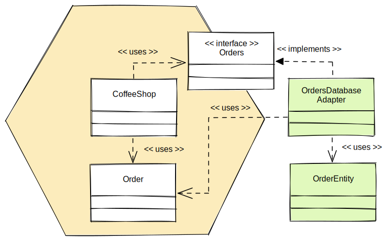

# Hexagon: Tách biệt logic công việc ra khỏi cơ sở hạ tầng với Ports và Adapters

_dịch từ [Arho Huttunen's Hexagonal Architecture Explained](https://www.arhohuttunen.com/hexagonal-architecture/)_

Kiến trúc lục giác là một mẫu kiến trúc được Alistair Cockburn giới thiệu và viết trên blog của ông vào năm 2005. Ý tưởng chính là cấu trúc ứng dụng (applications) để chúng ta có thể _phát triển và thử nghiệm nó một cách tách biệt với các công cụ và công nghệ bên ngoài_.

Đây là cách chính Cockburn mô tả kiến trúc trong một câu:

> Cho phép ứng dụng được điều khiển một cách bình đẳng bởi người dùng, chương trình, tập lệnh kiểm tra tự động hoặc tập lệnh batch, đồng thời được phát triển và kiểm tra tách biệt với các thiết bị và cơ sở dữ liệu trong thời gian chạy cuối cùng của ứng dụng đó. – Alistair Cockburn, 2005

Trong bài viết này, chúng ta sẽ xem xét một số vấn đề gặp phải với các dự án phần mềm truyền thống. Sau đó chúng ta sẽ tìm hiểu về kiến trúc lục giác và cách nó giải quyết những vấn đề đó. Chúng tôi cũng sẽ xem xét một số chi tiết triển khai và các tùy chọn cho kiểm thử.

## Các vấn đề với cách tiếp cận truyền thống

Trước khi đi vào chi tiết về kiến trúc lục giác, chúng ta hãy xem xét một số vấn đề điển hình mà chúng ta có thể gặp phải với các ứng dụng quy mô lớn.

Ở front-end, _logic nghiệp vụ của ứng dụng bị rò rỉ vào giao diện người dùng_. Do đó, logic này khó kiểm thử vì nó bị dính mắc với giao diện người dùng. Logic cũng trở nên không sử dụng được trong các trường hợp sử dụng khác và thật khó để chuyển từ các trường hợp sử dụng do con người điều khiển sang các trường hợp sử dụng có lập trình.

Ở back-end, _logic nghiệp vụ trở nên bị dính mắc với cơ sở dữ liệu hoặc các thư viện và dịch vụ bên ngoài_. Điều này một lần nữa làm cho logic khó kiểm thử vì sự dích mắc. Nó cũng khiến việc chuyển đổi giữa các công nghệ hoặc đổi mới chồng công nghệ của chúng tôi trở nên khó khăn hơn.

Để khắc phục vấn đề trộn lẫn logic nghiệp vụ và chi tiết công nghệ, người ta thường giới thiệu kiến trúc phân lớp. Bằng cách đặt các mối quan tâm khác nhau lên lớp riêng của chúng, hứa hẹn là chúng ta có thể tách biệt chúng một cách dễ dàng.

_Kiến trúc phân lớp._

Từ một lớp, chúng tôi chỉ cho phép các thành phần truy cập vào các thành phần khác trên cùng lớp hoặc bên dưới. Về lý thuyết, điều này sẽ bảo vệ chúng ta khỏi những mối lo ngại khác nhau trộn lẫn vào nhau. Vấn đề là không có cơ chế rõ ràng để phát hiện những hành vi vi phạm lời hứa này và theo thời gian, chúng ta thường rơi vào tình huống tương tự mà chúng ta đã cố tránh.

Với lớp truy cập dữ liệu ở phía dưới cùng, **cơ sở dữ liệu sẽ định hướng thiết kế**. Khi chúng ta thiết kế các trường hợp sử dụng, chúng ta chủ yếu phải lập mô hình hành vi, nhưng CSDL là về việc lưu trữ trạng thái. Sẽ tốt hơn nếu bắt đầu với logic nghiệp vụ (lớp business logic ở giữa trong hình bên trên) của ứng dụng?

Các thực thể này dễ dàng rò rỉ lên các lớp trên, điều này dẫn đến việc yêu cầu thay đổi logic nghiệp vụ khi chúng tôi thực hiện các thay đổi đối với CSDL. Nếu chúng ta phải thay đổi cách chúng ta lưu trữ dữ liệu, tại sao điều đó lại phải thay đổi logic kinh doanh của chúng ta?

Trên đây chỉ là một ví dụ đơn giản hóa và hiếm khi thực tế đơn giản như vậy. Trên thực tế, chúng ta cần giao tiếp với các dịch vụ hoặc thư viện bên ngoài và không phải lúc nào cũng rõ những thứ này thuộc về đâu.

_Kiến trúc phân lớp với nhiều bộ phận hơn._

Khi chúng ta cần thêm các thành phần mới, các lớp kiến trúc cần được cập nhật. Điều này dễ dẫn đến các lối tắt và các chi tiết kỹ thuật bị rò rỉ vào logic nghiệp vụ, ví dụ: bằng cách tham chiếu trực tiếp API của bên thứ 3.

Những quan sát này sẽ cho chúng ta động lực để tìm kiếm các giải pháp thay thế. Có lẽ có một số cách tốt hơn để đóng khung kiến trúc của chúng ta?

## Kiến trúc lục giác là gì?

Như đã đề cập, ý tưởng chính của kiến trúc lục giác là **tách logic nghiệp vụ khỏi thế giới bên ngoài**. Tất cả logic nghiệp vụ đều tồn tại bên trong ứng dụng, trong khi mọi thực thể bên ngoài đều nằm bên ngoài ứng dụng. Bên trong ứng dụng không được biết đến bên ngoài.

Mục tiêu là ứng dụng có thể được kiểm soát như nhau bởi người dùng, hoặc các mã kiểm thử khác. Chúng ta có thể phát triển và kiểm thử logic nghiệp vụ một cách tách biệt với các khung phần mềm (framework), cơ sở dữ liệu, hoặc các dịch vụ bên ngoài.

### Cổng và bộ điều hợp

Để thực hiện việc tách biệt logic nghiệp vụ và thế giới bên ngoài, ứng dụng chỉ giao tiếp với thế giới bên ngoài thông qua các **cổng (ports)**. Các cổng này mô tả mục đích trò chuyện giữa hai phía. Ứng dụng không liên quan đến chi tiết kỹ thuật đằng sau các cổng này.

**Bộ điều hợp (Adpaters)** cung cấp kết nối với thế giới bên ngoài. Chúng **dịch các tín hiệu của thế giới bên ngoài** sang dạng mà ứng dụng có thể hiểu được. Bộ điều hợp chỉ giao tiếp với ứng dụng thông qua các cổng.

_Tách biệt logic nghiệp vụ và các hạ tầng kỹ thuật trong kiến trúc Lục giác._

Một cổng có thể có nhiều bộ điều hợp đằng sau nó. Các bộ điều hợp có thể hoán đổi cho nhau mà không cần động vào logic nghiệp vụ. Điều này giúp dễ dàng phát triển giải pháp sử dụng các giao diện hoặc công nghệ mới.

Ví dụ: trong ứng dụng quán cà phê, có thể có giao diện người dùng ở điểm bán hàng xử lý việc nhận đơn đặt hàng cà phê. Khi nhân viên pha chế gửi đơn đặt hàng, bộ điều hợp REST sẽ nhận yêu cầu HTTP POST và dịch nó sang dạng mà một cổng hiểu được. Việc gọi cổng sẽ kích hoạt logic nghiệp vụ liên quan đến việc đặt đơn hàng bên trong ứng dụng. Bản thân ứng dụng không biết rằng nó đang được vận hành thông qua REST API.

_Các bộ điều hợp dịch các tín hiệu từ thế giới bên ngoài cho ứng dụng._

Ở phía bên kia của ứng dụng, ứng dụng giao tiếp với một cổng cho phép lưu trữ (ghi xuống CSDL) các đơn hàng. Nếu ta muốn sử dụng cơ sở dữ liệu quan hệ làm giải pháp lưu trữ, bộ điều hợp cơ sở dữ liệu sẽ triển khai kết nối đến cơ sở dữ liệu. Bộ điều hợp lấy thông tin từ cổng và dịch nó sang SQL để lưu trữ đơn hàng trong cơ sở dữ liệu. Bản thân ứng dụng không biết về triển khai này hoặc công nghệ lưu trữ được sử dụng.

> Nhiều bài viết nói về Kiến trúc lục giác có đề cập đến các lớp. Tuy nhiên, bài viết gốc không nói gì về các lớp. Chỉ đề cập đến bên trong và bên ngoài của ứng dụng. Ngoài ra, nó không nói gì về cách thực hiện ở bên trong. Chúng ta có thể định nghĩa các lớp theo cách của mình, hoặc tổ chức các thành phần theo tính năng, hay áp dụng các mẫu DDD - tùy vào hoàn cảnh.

### Bộ điều hợp sơ cấp và thứ cấp

Như chúng ta đã thấy, một số bộ điều hợp gọi các trường hợp sử dụng của ứng dụng, trong khi một số bộ điều hợp khác phản ứng với các hành động do ứng dụng kích hoạt. Bộ điều hợp điều khiển ứng dụng được gọi là **bộ điều hợp sơ cấp hoặc bộ điều hợp điều khiển**, thường được vẽ ở phía bên trái của sơ đồ. Các bộ điều hợp bị điều khiển bởi ứng dụng được gọi là **bộ điều hợp thứ cấp hoặc bộ điều hợp bị điều khiển**, thường được vẽ ở bên phải sơ đồ.

_Các bộ điều hợp sơ cấp và thứ cấp với các trường hợp sử dụng tại biên của ứng dụng._

Sự khác biệt giữa sơ cấp và thứ cấp dựa trên **cái nào kích hoạt giao tiếp**. Điều này liên quan đến ý tưởng từ các trường hợp sử dụng của các tác nhân sơ cấp và tác nhân thứ cấp.

Tác nhân sơ cấp là tác nhân thực hiện một trong các chức năng của ứng dụng. Điều này làm cho các cổng của ứng dụng trở nên phù hợp một cách tự nhiên để mô tả **các trường hợp sử dụng** của ứng dụng. Tác nhân thứ cấp là những cái mà ứng dụng nhận được câu trả lời từ nó hoặc thông báo đến nó. Điều này dẫn đến các cổng thứ cấp có thể chia thành hai loại: **kho lưu trữ** và **người nhận**.

Chúng ta nên viết các trường hợp sử dụng ở **biên của ứng dụng**. Trường hợp sử dụng không được chứa bất kỳ kiến thức chi tiết nào về các công nghệ bên ngoài ứng dụng. Kiến trúc lục giác có thể khuyến khích cách viết trường hợp sử dụng ưa thích.

> Một sai lầm điển hình là chúng ta viết các trường hợp sử dụng với kiến thức về các công nghệ cụ thể. Những trường hợp sử dụng như vậy không diễn tả ngôn ngữ nghiệp vụ mà trở nên gắn liền với các công nghệ được sử dụng và khó bảo trì hơn.

## Triển khai

Cho đến nay, chúng ta chỉ tuyên bố rằng các chi tiết kỹ thuật sẽ nằm ngoài ứng dụng. Giao tiếp giữa bộ điều hợp và ứng dụng chỉ nên diễn ra thông qua các cổng. Hãy xem điều này có ý nghĩa gì trong thực tế.

### Đảo ngược phụ thuộc

Khi chúng ta triển khai bộ điều hợp sơ cấp ở phía điều khiển, bộ điều hợp phải yêu cầu ứng dụng thực hiện điều gì đó. **Luồng điều khiển đi từ bộ điều hợp đến ứng dụng thông qua các cổng**. Sự phụ thuộc giữa bộ điều hợp và ứng dụng hướng vào bên trong, khiến ứng dụng không biết ai đang gọi các trường hợp sử dụng của nó.

_Sơ đồ triển khai các bộ điều hợp sơ cấp._

Trong ví dụ về quán cà phê, `OrderController` là một bộ điều hợp gọi đến một trường hợp sử dụng được xác định bởi cổng `PlaceingOrders`. Bên trong ứng dụng, `CoffeeShop` là lớp thực hiện chức năng được mô tả bởi cổng. Ứng dụng không biết ai đang gọi các trường hợp sử dụng của nó.

Khi chúng ta triển khai bộ điều hợp thứ cấp ở phía được điều khiển, **luồng điều khiển sẽ đi ra khỏi ứng dụng** vì chúng ta phải cho bộ điều hợp cơ sở dữ liệu biết rằng nó sẽ lưu trữ một đơn đặt hàng. Tuy nhiên, nguyên tắc kiến trúc của chúng ta nói rằng ứng dụng không nên biết về các chi tiết của thế giới bên ngoài.

Để đạt được điều này, chúng ta phải áp dụng nguyên tắc đảo ngược phụ thuộc.

> Các mô-đun cấp cao không nên phụ thuộc vào các mô-đun cấp thấp. Cả hai nên phụ thuộc vào sự trừu tượng (ví dụ: giao diện). Sự trừu tượng không nên phụ thuộc vào chi tiết. Chi tiết (triển khai cụ thể) sẽ phụ thuộc vào sự trừu tượng. – Robert C. Martin, 2003

Trong trường hợp của chúng ta, đây là một cách nói hoa mỹ để nói rằng ứng dụng không nên phụ thuộc trực tiếp vào bộ điều hợp cơ sở dữ liệu. Thay vào đó, ứng dụng sẽ sử dụng một cổng và sau đó bộ điều hợp sẽ triển khai cổng đó.

_Triển khai bộ điều hợp thứ cấp._

Việc triển khai `CoffeeShop` không nên phụ thuộc trực tiếp vào việc triển khai `OrderDatabaseAdapter` mà nên sử dụng giao diện `Orders` và để `OrderDatabaseAdapter` triển khai giao diện đó. Điều này đảo ngược sự phụ thuộc và đảo ngược mối quan hệ một cách hiệu quả.

Chúng ta cũng có thể nói rằng `CoffeeShop` có phần phụ thuộc có thể cấu hình trên giao diện `Orders`, được triển khai bởi `OrderDatabaseAdapter`. Tương tự, `OrderController` có phần phụ thuộc có thể định cấu hình trên giao diện `PlacingOrders`, do CoffeeShop triển khai. Để cấu hình các phần phụ thuộc này, chúng ta có thể sử dụng kỹ thuật `dependency injection` làm mẫu triển khai.

### Ánh xạ trong bộ điều hợp

Bộ điều hợp phải dịch các tín hiệu của thế giới bên ngoài sang thứ mà ứng dụng hiểu được và ngược lại. Trên thực tế, điều này có nghĩa là các bộ điều hợp sẽ ánh xạ bất kỳ mô hình ứng dụng nào tới một mô hình bộ điều hợp và ngược lại.

Trong ví dụ của chúng ta, để phân biệt giữa mô hình bên ngoài và mô hình bên trong, ta có thể đưa ra mô hình `OrderRequest` thể hiện dữ liệu đến bộ điều hợp dưới dạng yêu cầu REST. `OrderController` chịu trách nhiệm ánh xạ `OrderRequest` vào mô hình `Order` mà ứng dụng hiểu được.

_Ánh xạ các mô hình ở bộ điều hợp sơ cấp._

Tương tự, khi bộ điều hợp cần phản hồi tác nhân gọi nó, chúng ta có thể đưa ra mô hình `OrderResponse` và để bộ điều hợp ánh xạ mô hình `Order` từ ứng dụng thành mô hình phản hồi.

Thoạt đầu có vẻ như chúng ta phải làm thêm nhiều việc. Chúng ta có thể trả về trực tiếp các mô hình từ ứng dụng, nhưng điều này đặt ra một số vấn đề.

Đầu tiên, nếu chúng ta cần ví dụ: định dạng dữ liệu, sau đó chúng ta cần đưa **hiểu biết cụ thể về công nghệ vào bên trong ứng dụng**. Điều này phá vỡ nguyên tắc kiến trúc rằng ứng dụng không được biết về các chi tiết của thế giới bên ngoài. Nếu một số bộ điều hợp khác cần sử dụng cùng một dữ liệu thì việc sử dụng lại mô hình có thể không thực hiện được.

Thứ hai, chúng ta đang làm cho việc tái cấu trúc bên trong ứng dụng trở nên khó khăn hơn vì mô hình của chúng ta hiện đã được đưa ra thế giới bên ngoài. Nếu ai đó dựa vào API mà chúng ta hiển thị, chúng ta sẽ tạo ra các thay đổi mang tính phá vỡ mỗi khi chúng ta tái cấu trúc mô hình của mình.

Ở phía bên kia của ứng dụng trong ví dụ này, chúng tôi có thể đưa ra mô hình `OrderEntity` để mô tả các chi tiết cần thiết để lưu trữ dữ liệu. `OrderDatabaseAdapter` dành cho loại công nghệ được chọn, hiện chịu trách nhiệm dịch mô hình `Order` từ ứng dụng sang cái mà lớp lưu trữ (CSDL) hiểu được.

_Ánh xạ các mô hình dữ liệu ở bộ điều hợp thứ cấp._

Một lần nữa, việc sử dụng một mô hình duy nhất cho các thực thể cơ sở dữ liệu và ứng dụng có thể rất hấp dẫn nhưng nó đi kèm với chi phí. Nó khiến ta phải đưa các **chi tiết cụ thể về công nghệ vào bên trong mô hình ứng dụng**. Tùy thuộc vào chồng công nghệ mà bạn sử dụng, điều này có thể có nghĩa là giờ đây bạn phải lo lắng về các chi tiết như giao dịch và lazy loading bên trong logic nghiệp vụ của mình.

## Kiểm thử

Một mục tiêu của kiến trúc lục giác được đề cập là khả năng kiểm tra logic nghiệp vụ tách biệt với các công cụ và công nghệ bên ngoài. Đây là điều xuất phát một cách tự nhiên từ việc tách biệt các mối quan tâm được thực hiện với các cổng và bộ điều hợp. Nếu không có sự tách biệt này, các lựa chọn thử nghiệm của chúng tôi sẽ bị hạn chế hơn nhiều và có xu hướng kiểm thử rộng hơn.

### Kiểm thử logic nghiệp vụ

Bước đầu tiên trong việc triển khai một trường hợp sử dụng là bắt đầu bằng một bài kiểm thử mô tả nó (TDD). Chúng ta bắt đầu với ứng dụng dưới dạng hộp đen và chỉ cho phép thử nghiệm gọi ứng dụng thông qua các cổng của nó. Chúng ta cũng nên thay thế bất kỳ bộ điều hợp thứ cấp nào bằng bộ điều hợp mô phỏng (giả lập / mock).

_Kiểm thử đơn vị cho logic nghiệp vụ._

Mặc dù có thể sử dụng một khung giả lập kiểm thử ở đây, nhưng việc viết các mô hình giả lập (mocks) hoặc stubs của riêng bạn sẽ tỏ ra có giá trị sau này. Đối với bất kỳ bộ điều hợp kho lưu trữ nào, các giả lập (mocks) này có thể đơn giản chỉ là ánh xạ các giá trị (map of values).

### Kiểm thử các bộ điều hợp sơ cấp

Bước tiếp theo là kết nối một số bộ điều hợp với ứng dụng. Chúng ta thường bắt đầu từ phía bộ điều hợp sơ cấp. Điều này cho phép ứng dụng được điều khiển bởi một số người dùng thực tế.

Chúng ta có thể tiếp tục sử dụng bộ điều hợp mô phỏng từ bước cuối cùng cho bộ điều hợp thứ cấp. Sau đó, các thử nghiệm tích hợp hẹp của chúng ta sẽ gọi bộ điều hợp sơ cấp để kiểm thử nó. Trên thực tế, chúng tôi có thể gửi phiên bản đầu tiên của giải pháp của mình với các bộ điều hợp thứ cấp được triển khai dưới dạng sơ khai.

_Kiểm thử các bộ điều hợp sơ cấp._

Ví dụ: thử nghiệm tích hợp có thể thực hiện một số yêu cầu HTTP tới bộ điều khiển REST và xác nhận rằng phản hồi phù hợp với mong đợi của chúng tôi. Mặc dù bộ điều khiển REST đang gọi ứng dụng nhưng ứng dụng không phải là đối tượng được thử nghiệm.

Nếu sử dụng thử nghiệm giả lập cho ứng dụng trong các thử nghiệm này, ta sẽ phải tập trung nhiều hơn vào việc xác minh tương tác giữa bộ điều hợp và ứng dụng. Khi chỉ giả lập (mock) các bộ điều hợp bên phải, chúng tôi có thể tập trung vào thử nghiệm dựa trên trạng thái.

> Chúng ta nên đảm bảo chỉ kiểm tra trách nhiệm của bộ điều khiển (controller) trong các thử nghiệm này. Chúng ta có thể tự mình kiểm tra các trường hợp sử dụng của ứng dụng.

### Kiểm thử các bộ điều hợp thứ cấp

Đến lúc triển khai bộ điều hợp bên phải, chúng tôi muốn kiểm tra xem hoạt động tích hợp với công nghệ của bên thứ 3 có hoạt động chính xác hay không. Thay vì kết nối với cơ sở dữ liệu hoặc dịch vụ từ xa, chúng ta có thể đóng hộp (tại máy địa phương) cơ sở dữ liệu hoặc dịch vụ đó và cấu hình app để kết nối với cơ sở dữ liệu hoặc dịch vụ đó.

_Kiểm thử các bộ điều hợp thứ cấp._

Ví dụ: trong thế giới Java, có thể sử dụng thứ gì đó như Testcontainers hoặc MockWebServer để thay thế cơ sở dữ liệu hoặc dịch vụ từ xa thực sự. Điều này cho phép chúng tôi sử dụng công nghệ cơ bản tại địa phương mà không cần phải dựa vào sự sẵn có của các dịch vụ bên ngoài.

### Kiểm thử từ đầu tới cuối

Mặc dù chúng tôi có thể bao quát các phần khác nhau của hệ thống bằng các thử nghiệm đơn vị và tích hợp, nhưng điều đó là không đủ để loại bỏ tất cả các vấn đề. Đây là lúc các thử nghiệm đầu cuối (còn được gọi là thử nghiệm tích hợp rộng hoặc thử nghiệm hệ thống) trở nên hữu ích.

_Kiểm thử đầu cuối toàn hệ thống._

Chúng tôi vẫn có thể cách ly hệ thống khỏi các dịch vụ bên ngoài nhưng kiểm tra toàn bộ hệ thống. Các thử nghiệm toàn diện này thực thi toàn bộ phần của hệ thống từ bộ điều hợp sơ cấp đến ứng dụng cho đến bộ điều hợp thứ cấp.

Điều chúng ta tìm kiếm trong các thử nghiệm này là việc thực thi các đường dẫn chính của ứng dụng. Mục đích không phải là để xác minh các trường hợp sử dụng chức năng mà là chúng ta đã kết nối ứng dụng với nhau một cách chính xác và nó đang hoạt động.

> Cách tiếp cận này rõ ràng sẽ dẫn đến một số thử nghiệm chồng chéo. Để tránh lặp đi lặp lại việc kiểm tra những thứ giống nhau ở các cấp độ khác nhau, điều quan trọng là phải suy nghĩ về trách nhiệm của đối tượng được kiểm tra.

## Ưu điểm và Nhược điểm

Kiến trúc tốt cho phép phần mềm có thể thay đổi liên tục với ít nỗ lực nhất có thể. Mục tiêu là giảm thiểu chi phí trọn đời của hệ thống và tối đa hóa năng suất.

Kiến trúc lục giác có một số lợi thế đáp ứng được các tiền đề sau:

- Ta có thể trì hoãn các quyết định về chi tiết (chẳng hạn như sử dụng khung phần mềm hoặc cơ sở dữ liệu nào).
- Ta có thể thay đổi logic nghiệp vụ mà không động chạm đến bộ điều hợp.
- Ta có thể thay thế hoặc nâng cấp mã cơ sở hạ tầng mà không cần phải động đến logic nghiệp vụ.
- Ta có thể thúc đẩy ý tưởng viết các trường hợp sử dụng mà không cần biến đến các chi tiết kỹ thuật.
- Bằng cách đặt tên rõ ràng cho các cổng và bộ điều hợp, chúng ta có thể tách biệt các mối quan tâm tốt hơn và giảm nguy cơ chi tiết kỹ thuật bị rò rỉ vào logic nghiệp vụ.
- Chúng ta có các tùy chọn để kiểm thử các bộ phận của hệ thống một cách riêng biệt cũng như được nhóm lại với nhau.

Như với bất kỳ giải pháp nào, kiến trúc hình lục giác cũng có nhược điểm.

- Có thể bị lạm dụng kỹ thuật quá mức đối với các trường hợp chỉ cần giải pháp đơn giản (ví dụ ứng dụng CRUD hoặc microservice).
- Đòi hỏi sức lực trong việc tạo các mô hình riêng biệt và ánh xạ giữa chúng.

**Sau cùng, quyết định sử dụng kiến trúc lục giác phụ thuộc vào độ phức tạp của bài toán. Luôn có thể bắt đầu với một cách tiếp cận đơn giản hơn và tiến hóa kiến trúc khi có nhu cầu.**

## Tổng kết

Ý tưởng chính của kiến trúc lục giác là tách logic nghiệp vụ khỏi các chi tiết kỹ thuật. Điều này được thực hiện bằng cách cô lập những mối quan tâm thông qua các giao diện.

Ở một bên của ứng dụng, chúng ta tạo các bộ điều hợp sử dụng giao diện ứng dụng. Ví dụ: đây có thể là các bộ điều khiển (controllers) ứng dụng. Ở phía bên kia của ứng dụng, chúng ta tạo các bộ điều hợp triển khai các giao diện ứng dụng. Ví dụ: đây có thể là các kho lưu trữ mà ứng dụng nhận được câu trả lời từ đó.

Trong bài viết tiếp theo, chúng ta sẽ xem xét cách triển khai kiến trúc lục giác trong một ứng dụng sử dụng Spring Boot.
