# Kiến trúc lục giác: Một cái nhìn toàn diện

_Lược dịch từ [Sven Woltmann's Hexagonal Architecture: What, Why, and How](https://www.happycoders.eu/software-craftsmanship/hexagonal-architecture/)_

Trong bài viết này:

- Kiến trúc lục giác là gì? (Tên gọi chính thức của nó là "Cổng và Bộ điều hợp")
- Ưu điểm của nó so với kiến trúc phân tầng cổ điển
- So sánh với "Kiến trúc sạch" (Clean Architecture) và "Kiến trúc củ hành" (Onion Architecture)
- Sự liên quan giữa kiến trúc này và Microservices, và Domain Driven Design (thiết kế hướng nghệp vụ)

Trước khi đi vào chi tiết, tôi giải thích ngắn gọn mục đích của **kiến trúc phần mềm** và _tại sao kiến trúc phân lớp, mẫu kiến trúc được sử dụng rộng rãi nhất lại không phù hợp cho các dự án lớn_.

## Mục đích của kiến trúc phần mềm là gì?

**Kiến trúc**, chúng ta muốn nói đến việc phân chia một hệ thống thành các thành phần, sự sắp xếp chúng và cách thức các thành phần này giao tiếp với nhau.

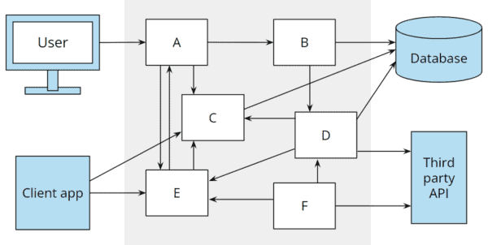

_Kiến trúc theo lối "phát triển theo thời gian"_

Kiến trúc tốt hướng tới việc dễ dàng thay đổi/thích nghi của phần mềm với các yêu cầu và biến động trong tương lai.

Những thay đổi có thể là:

- Những điều chỉnh liên quan tới quy định pháp lý mới
- Sử dụng các công nghệ hiện đại hơn (ví dụ thay thế SOAP bằng REST API, ...)
- Nâng cấp các cơ sở hạ tầng (ví dụ: máy chủ cơ sở dữ liệu, thay đổi hệ quản lý cơ sở dữ liệu ...)
- Cần kết nối với một hệ thống mới của bên thứ 3

### Làm thế nào để phát triển một kiến trúc tốt

Để giữ cho phần mềm “mềm”, ứng dụng phải được chia thành các thành phần riêng biệt, có thể phát triển độc lập và có thể kiểm thử được. (Việc triển khai tự động cũng được yêu cầu nhưng không phải là chủ đề của bài viết này).

Trong hầu hết các ứng dụng kinh doanh, các lập trình viên cố gắng đạt được mục tiêu này thông qua kiến trúc phân lớp cổ điển:

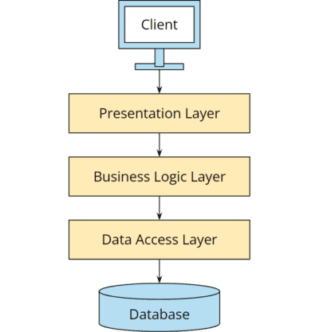

_Kiến trúc ba lớp cổ điển._

Tuy nhiên, thực tế đã chỉ ra rằng kiến trúc phân lớp không phù hợp lắm cho các dự án lớn. Ta sẽ thấy nguyên nhân trong phần tiếp theo.

### Nhược điểm của kiến trúc lớp

Kiến trúc phân lớp dẫn đến sự dính kết không cần thiết với những hậu quả tiêu cực:

- Logic nghiệp vụ phụ thuộc trực tiếp vào cơ sở dữ liệu, trong khi lớp trình bày có sự phụ thuộc bắc cầu. Ví dụ: tất cả các thực thể, kho lưu trữ và thư viện ORM cũng có sẵn trong lớp trình bày (presentation layer). Điều này cám dỗ các nhà phát triển để ranh giới giữa các lớp suy yếu, đặc biệt là khi chúng bị ép về thời gian.

- Việc dính kết cũng gây khó khăn không cần thiết cho việc nâng cấp cơ sở dữ liệu hoặc lớp truy cập dữ liệu (ví dụ: lên phiên bản cơ sở dữ liệu mới hoặc phiên bản mới của trình ánh xạ O/R). Tôi đã thấy nhiều ứng dụng kinh doanh chạy với các phiên bản Hibernate hoặc EclipseLink đã lỗi thời (tức là có lỗi và/hoặc không an toàn) vì một bản cập nhật sẽ yêu cầu điều chỉnh trong tất cả các lớp của ứng dụng và đã bị ban quản lý giảm mức độ ưu tiên.

- Nhân tiện, điều này không chỉ ảnh hưởng đến cơ sở dữ liệu mà còn ảnh hưởng đến bất kỳ loại cơ sở hạ tầng nào mà ứng dụng truy cập. Tôi thậm chí đã gặp phải quyền truy cập vào API đồ thị của Facebook từ lớp trình bày.

- Sự xóa mờ ranh giới lớp khiến cho việc kiểm thử các thành phần riêng lẻ là bất khả - ví dụ: logic nghiệp vụ không có giao diện người dùng và cơ sở dữ liệu.

## Kiến trúc Lục giác là gì?

Alistair Cockburn đã giới thiệu kiến trúc phần mềm hình lục giác trong một bài viết trên blog vào năm 2005. Cockburn nêu các mục tiêu sau:

- Ứng dụng phải được kiểm soát như nhau bởi người dùng, hay các ứng dụng khác, hoặc các kiểm thử tự động. Đối với logic nghiệp vụ, không có gì khác biệt cho dù nó được gọi từ giao diện người dùng, API REST hay khung kiểm thử.
- Logic nghiệp vụ phải có thể được phát triển và thử nghiệm tách biệt với cơ sở dữ liệu, cơ sở hạ tầng khác và hệ thống của bên thứ ba. Từ góc độ logic nghiệp vụ, không có gì khác biệt cho dù dữ liệu được lưu trữ trong cơ sở dữ liệu quan hệ, hệ thống NoSQL, tệp XML hay định dạng nhị phân độc quyền.
- Hiện đại hóa cơ sở hạ tầng (ví dụ: nâng cấp máy chủ cơ sở dữ liệu, thích ứng với các giao diện bên ngoài đã thay đổi, nâng cấp các thư viện không an toàn) có thể thực hiện được mà không cần điều chỉnh logic nghiệp vụ.

Trong các phần sau, bạn sẽ tìm hiểu cách kiến trúc lục giác đạt được những mục tiêu này.

### Cổng và Bộ điều hợp

Việc tách biệt logic nghiệp vụ (được gọi là “ứng dụng” trong kiến trúc lục giác) khỏi thế giới bên ngoài đạt được thông qua cái gọi là “cổng” và “bộ điều hợp”, như thể hiện trong sơ đồ sau:

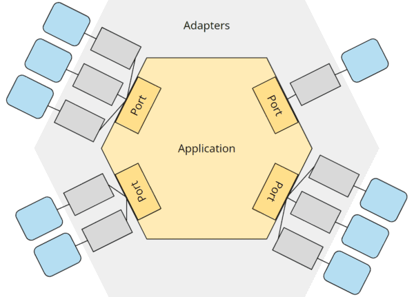

_Kiến trúc lục giác với logic nghiệp vụ trong lõi (“ứng dụng”), cổng, bộ điều hợp và các thành phần bên ngoài._

Logic nghiệp vụ (“ứng dụng”) là cốt lõi của kiến trúc. Nó xác định các giao diện (“cổng”) để giao tiếp với thế giới bên ngoài – cả hai đều được kiểm soát (bởi API, giao diện người dùng, bởi các ứng dụng khác) và để kiểm soát (cơ sở dữ liệu, giao diện bên ngoài và cơ sở hạ tầng khác).

Logic nghiệp vụ chỉ biết các cổng này; tất cả các trường hợp sử dụng (_use-cases_) của nó đều được triển khai độc nhất tuân theo thông số kỹ thuật của cổng (_ports_). Các chi tiết kỹ thuật nằm đằng sau các cổng này không liên quan đến logic nghiệp vụ.

Hình minh họa sau đây cho thấy một ứng dụng mẫu mực

1. được điều khiển bởi người dùng thông qua giao diện người dùng,
2. được điều khiển bởi người dùng thông qua REST API,
3. được điều khiển bởi một ứng dụng bên ngoài thông qua cùng REST API,
4. điều khiển cơ sở dữ liệu và
5. điều khiển một ứng dụng bên ngoài.
   (Việc đánh số không thể hiện thứ tự mà tham chiếu đến các mũi tên trong hình minh họa).

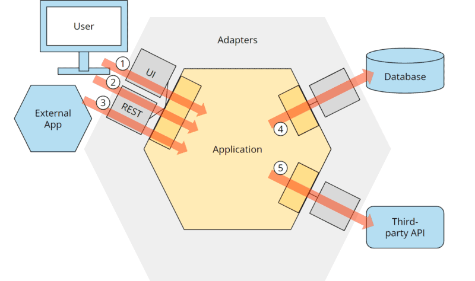

_Kiến trúc lục giác với các luồng điều khiển._

Nhiều bộ điều hợp có thể được kết nối với một cổng. Ví dụ: như trong ví dụ trên, cả bộ điều hợp giao diện người dùng và bộ điều hợp REST đều có thể được kết nối với cổng để điều khiển ứng dụng. Và cổng gửi thông báo có thể có bộ điều hợp email, bộ điều hợp SMS và bộ điều hợp WhatsApp được kết nối với nó.

Tình cờ, thuật ngữ “cổng” dùng để chỉ các kết nối điện mà bất kỳ thiết bị nào tuân thủ các giao thức cơ và điện của kết nối đều có thể được kết nối.

### Cổng và Bộ điều hợp sơ cấp và thứ cấp

Từ ví dụ trên, chúng ta đã thấy hai loại cổng và bộ điều hợp – loại điều khiển ứng dụng và loại được ứng dụng điều khiển.

Chúng tôi gọi nhóm đầu tiên là các cổng và bộ điều hợp "sơ cấp" hoặc "lái" (primary or driving); chúng thường được hiển thị ở phía bên trái của hình lục giác.

Chúng tôi gọi nhóm thứ hai là các cổng và bộ điều hợp “thứ cấp” hoặc “được lái”, thường được hiển thị ở bên phải.

### Quy tắc phụ thuộc

Về lý thuyết, điều này nghe có vẻ khá hay. Nhưng làm cách nào để chúng ta đảm bảo về mặt lập trình rằng không có chi tiết kỹ thuật nào (như thực thể JPA) và thư viện (như trình ánh xạ O/R) bị rò rỉ vào ứng dụng?

Chúng ta có thể tìm thấy câu trả lời trong cái gọi là “quy tắc phụ thuộc”. Quy tắc này nêu rõ rằng tất cả các phần phụ thuộc của mã nguồn chỉ có thể trỏ từ bên ngoài vào trong, tức là theo hướng của hình lục giác ứng dụng:

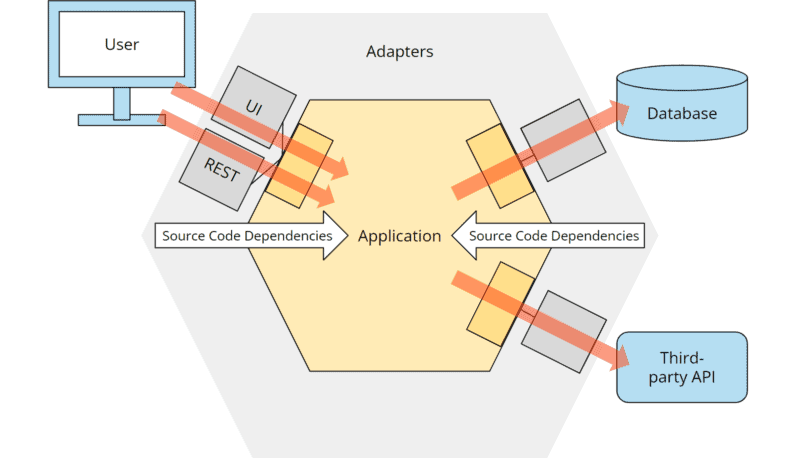

_Kiến trúc lục giác: quy tắc phụ thuộc._

Việc ánh xạ vào các lớp và mối quan hệ của chúng với nhau khá đơn giản đối với các cổng và bộ điều hợp sơ cấp (tức là phía bên trái của hình).

Tiếp tục với ví dụ đăng ký người dùng, chúng ta có thể triển khai kiến trúc mong muốn với một số thứ giống như các lớp sau:

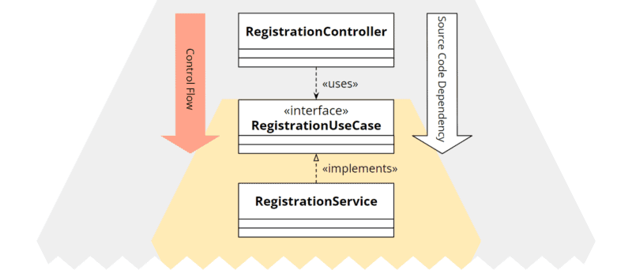

_Kiến trúc lục giác: sơ đồ lớp của cổng sơ cấp và bộ điều hợp._

RegistrationController là bộ điều hợp, giao diện RegistrationUseCase xác định cổng sơ cấp và RegistrationService triển khai chức năng được mô tả bởi cổng. (Tôi lấy quy ước đặt tên này từ cuốn sách cực hay “Hãy làm bẩn tay bạn trên kiến trúc sạch” của Tom Hombergs). Vì ở hướng này, các yêu cầu đến từ bên ngoài gọi vào trong lõi, do đó dịch vụ lõi cần _triển khai_ các hàm viết trong giao diện còn bộ điều hợp (controller trong trường hợp này) sử dụng giao diện viết trong cổng.

Sự phụ thuộc mã nguồn đi từ RegistrationController đến RegistrationUseCase, do đó, theo như kiến trúc, sẽ hướng tới phần lõi.

Nhưng làm cách nào để chúng ta triển khai các cổng và bộ điều hợp thứ cấp, tức là phía bên phải của hình ảnh nơi phần phụ thuộc mã nguồn phải ngược với hướng gọi yêu cầu? Ví dụ: làm cách nào lõi ứng dụng có thể truy cập cơ sở dữ liệu nếu cơ sở dữ liệu nằm ngoài lõi và phần phụ thuộc mã nguồn sẽ hướng về trung tâm?

Đây là lúc nguyên tắc đảo ngược phụ thuộc phát huy tác dụng.

### Đảo ngược phụ thuộc

Tương tự như trên, cổng được định nghĩa bởi một giao diện. Tuy nhiên, mối quan hệ giữa các lớp bị hoán đổi: PersistanceAdapter không sử dụng PersistencePort mà _triển khai_ nó (vì nó sẽ được gọi hướng từ trong ra). Và RegistrationService không triển khai PersistencePort mà _sử dụng_ nó:

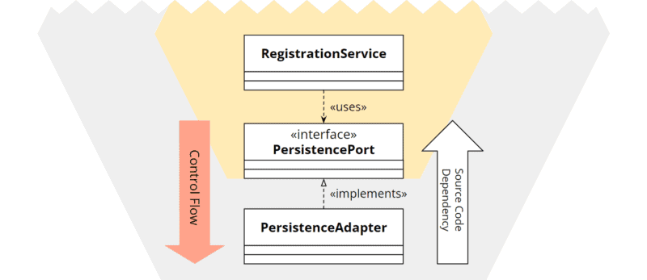

_Kiến trúc lục giác: sơ đồ lớp của cổng và bộ điều hợp thứ cấp._

Bằng cách sử dụng nguyên tắc đảo ngược phụ thuộc, chúng ta có thể chọn hướng của phụ thuộc mã – đối với các cổng và bộ điều hợp thứ cấp ngược với hướng gọi.

### Ánh xạ

(Ví dụ phần này liên quan tới cơ sở dữ liệu và ánh xạ sơ đồ quan hệ, cùng với các kỹ thuật viết bộ điều hợp để thực hiện ánh xạ từ trong lõi ứng dụng tới lớp lưu trữ bên ngoài ...)

### Kiểm thử

Ở đầu bài viết, tôi đã đề cập đến “các thành phần có thể kiểm thử riêng biệt” như một trong những yêu cầu để có kiến trúc phần mềm tốt. Trên thực tế, kiến trúc lục giác giúp chúng ta dễ dàng (như bạn cũng sẽ thấy trong thực tế trong các phần sau của loạt bài này) để kiểm tra logic nghiệp vụ của ứng dụng:

- Các kiểm thử có thể gọi logic nghiệp vụ thông qua các cổng sơ cấp.
- Các cổng thứ cấp có thể được kết nối với các giả lập kiểm thử, ví dụ: ở dạng sơ khai để trả lời các truy vấn từ ứng dụng hoặc theo dõi để ghi lại các sự kiện do ứng dụng gửi.

Sơ đồ sau đây cho thấy một kiểm thử đơn vị (unit test) tạo một bản thử kép (giả lập) cho cơ sở dữ liệu và kết nối nó với cổng cơ sở dữ liệu thứ cấp (“Sắp xếp”), gọi một trường hợp sử dụng trên cổng chính (“Act”) và xác minh phản hồi và tương tác của cổng với bản thử kép (“Khẳng định”):

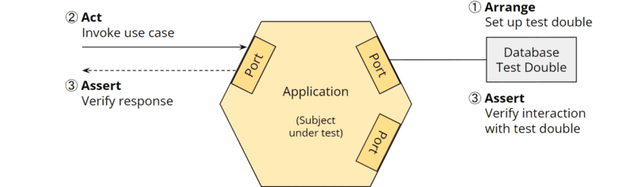

_Kiến trúc lục giác: kiểm thử đơn vị cho logic nghiệp vụ_

Logic nghiệp vụ không chỉ có thể được kiểm tra tách biệt với các bộ điều hợp mà còn có thể kiểm tra các bộ điều hợp tách biệt với logic nghiệp vụ.

Sơ đồ sau đây cho thấy quá trình kiểm tra tích hợp tạo ra một kiểm tra kép cho cổng chính (“Sắp xếp”), gửi yêu cầu HTTP POST tới bộ điều hợp REST thông qua REST Assured (“Act”) và cuối cùng xác minh phản hồi HTTP và tương tác với kiểm tra kép (“Khẳng định”):

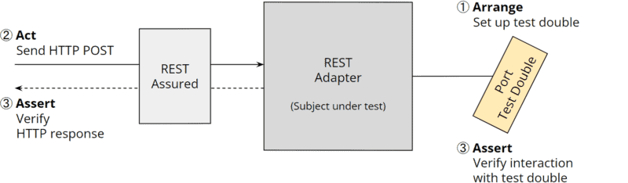

_Kiến trúc lục giác: kiểm thử tích hợp cho bộ điều hợp REST_

Sơ đồ bên trên hiển thị quá trình kiểm tra tích hợp cho bộ điều hợp cơ sở dữ liệu sử dụng TestContainers để khởi động cơ sở dữ liệu thử nghiệm (“Sắp xếp”), gọi một phương thức trên bộ điều hợp cơ sở dữ liệu (“Act”) và cuối cùng kiểm tra xem giá trị trả về của phương thức và , nếu có thể, những thay đổi trong cơ sở dữ liệu thử nghiệm sẽ đáp ứng mong đợi (“Khẳng định”):

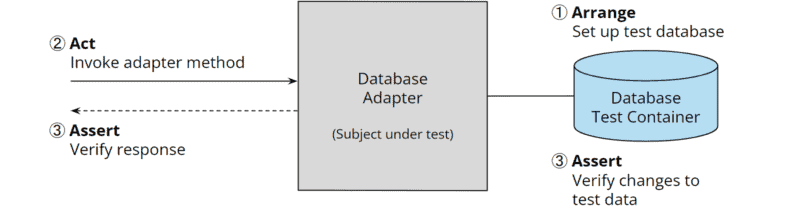

_Kiến trúc lục giác: kiểm thử tích hợp cho bộ điều hợp cơ sở dữ liệu_

Ngoài các thử nghiệm riêng biệt này, không nên thiếu các thử nghiệm hệ thống hoàn chỉnh (ở mức độ thấp hơn, theo kim tự tháp thử nghiệm).

### Tại sao lại là hình lục giác?

Alistair Cockburn thường được hỏi liệu hình lục giác hay số “sáu” có ý nghĩa cụ thể nào không. Câu trả lời của anh cho câu hỏi này là: “Không”. Anh ấy muốn sử dụng một hình dạng mà trước đây chưa ai từng sử dụng. Hình vuông được sử dụng ở mọi nơi và hình ngũ giác rất khó vẽ. Vì vậy, nó đã trở thành một hình lục giác.

Hình lục giác cũng rất phù hợp để vẽ hai cổng chính ở bên trái và hai cổng phụ ở bên phải. Cockburn cho biết anh chưa bao giờ gặp phải một dự án nào yêu cầu nhiều hơn bốn cổng để trình bày sơ đồ của nó.

### Ưu điểm của kiến trúc lục giác

- Khả năng sửa đổi mà không ảnh hưởng tới logic nghiệp vụ
- Sự cách ly: lõi ứng dụng không bị chi phối bởi hạ tầng công nghệ, chỉ liên quan tới logic nghiệp vụ
- Phát triển: sau khi định nghĩa được các **Cổng** (hay Trường hợp sử dụng) của ứng dụng, các công việc trên các thành phần riêng của thiết kế có thể được phân chia cho các thành viên trong đội/nhóm. Đây là cách phát triển từ trong lõi ra, hướng kiểm thử, cũng như hướng nghiệp vụ.
- Khả năng kiểm thử: như thấy ở trên, việc cách ly logic nghiệp vụ, và sử dụng cổng và các bộ điều hợp khiến cho việc kiểm thử từng thành phần và kiểm thử toàn bộ hệ thống có thể tự động hóa.

### Nhược điểm của kiến trúc lục giác

Việc triển khai các cổng và bộ điều hợp cũng như chiến lược ánh xạ đã chọn cần nỗ lực đáng kể. Nó khấu hao nhanh chóng cho các ứng dụng doanh nghiệp lớn; đối với các ứng dụng nhỏ hơn, chẳng hạn như một dịch vụ siêu nhỏ CRUD đơn giản với logic nghiệp vụ tối thiểu, thì nỗ lực thêm là không đáng.

Trong trường hợp tốt nhất, bạn có một nhà phát triển/kiến trúc sư cấp cao trong nhóm của mình, người đã có kinh nghiệm về kiến trúc lục giác và có thể đánh giá liệu nỗ lực kéo theo này có xứng đáng với dự án của bạn hay không.

Tôi khuyên bạn nên làm theo các ví dụ mà tôi sẽ trình bày cách triển khai kiến trúc lục giác trong các phần sau của loạt bài hướng dẫn này. Bằng cách này, bạn sẽ có được trải nghiệm đầu tiên và có thể trở thành nhà phát triển giàu kinh nghiệm, người đưa kiến trúc hình lục giác vào sử dụng cho dự án tiếp theo của bạn.

## Kiến trúc lục giác và DDD (Thiết kế hướng nghiệp vụ)

Trong sách vở, ta luôn gặp phải các thể nghiệm của kiến trúc lục giác cùng với “thực thể” và “trường hợp sử dụng” hoặc “dịch vụ” và/hoặc cùng với “miền” hoặc “mô hình miền” - đại khái như trong hình sau:

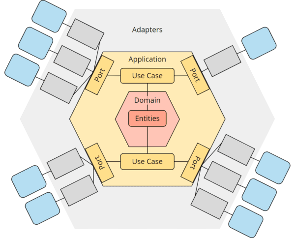

_Kiến trúc lục giác và DDD (thiết kế hướng nghiệp vụ)_

Trên thực tế, kiến trúc lục giác có chủ ý để ngỏ những gì bên trong hình lục giác của ứng dụng. Trong một cuộc phỏng vấn thú vị, Alistair Cockburn đã trả lời câu hỏi: “Bạn thấy gì bên trong ứng dụng?” với, “Tôi không quan tâm - không phải việc của tôi. Mẫu thiết kế hình lục giác thể hiện một quyết định thiết kế duy nhất: “Gói ứng dụng của bạn trong một API và đặt các kiểm thử xung quanh nó”.

Tuy nhiên, thiết kế hướng miền (DDD) và kiến trúc hình lục giác bổ sung cho nhau một cách đặc biệt tốt vì nguyên tắc DDD của thiết kế chiến thuật phù hợp lý tưởng để cấu trúc các quy tắc kinh doanh trong hình lục giác ứng dụng.

Do đó, tôi cũng sẽ sử dụng hình lục giác miền bổ sung này trong các bài viết tiếp theo của loạt bài này, trong đó tôi sẽ trình bày cách triển khai kiến trúc hình lục giác với Java.

## Kiến trúc lục giác và Microservices (Vi dịch vụ)

Kiến trúc hình lục giác cũng phù hợp để triển khai các Microservice, miễn là chúng đáp ứng hai tiêu chí:

- Chúng chứa logic nghiệp vụ và không thuần thúy kỹ thuật.
- Chúng phải có kích thước nhất định

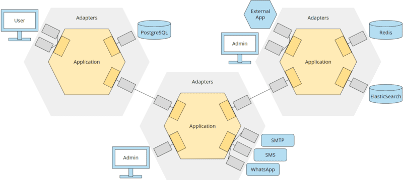

_Kiến trúc lục giác và Microservices (Vi dịch vụ)_

## Kiến trúc lục giác vs. "Cổng & Bộ điều hợp"

Tên chính thức do Alistair Cockburn (tác giả của kiến trúc lục giác) đặt cho kiến trúc này được mô tả trong bài viết "Cổng và Bộ điều hợp".

Tên gọi theo hình ảnh mô tả kiến trúc này ("Lục giác") trở nên phổ biến hơn. Alistair Cockburn cũng tiết lộ ông thích các tên theo hình ảnh hơn, nhưng tên chính thức của mẫu thiết kế cần phải mô tả tính chất của nó.

## Kiến trúc lục giác vs. Kiến trúc phân lớp

Ở đầu bài viết, tôi đã đề cập đến kiến trúc phân lớp được sử dụng rộng rãi và những nhược điểm của nó (phụ thuộc bắc cầu vào cơ sở dữ liệu, làm mờ ranh giới lớp, cách ly các thành phần kém, khả năng kiểm thử kém, khả năng bảo trì kém và khả năng thay thế lẫn nhau của các thành phần cơ sở hạ tầng).

Trong phần sau đây, bạn có thể thấy hai mẫu kiến trúc được so sánh. Ngược lại với kiến trúc lục giác (ở đây được trình bày ban đầu bởi Alistair Cockburn không có cổng rõ ràng), kiến trúc phân lớp không tập trung vào logic nghiệp vụ mà tập trung vào cơ sở dữ liệu:

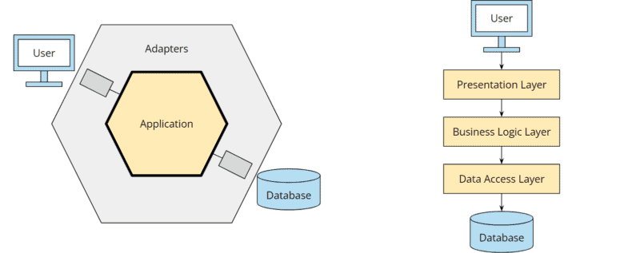

_Kiến trúc lục giác so với kiến trúc phân lớp_

Có thể nói, chúng ta áp dụng “thiết kế dựa trên cơ sở dữ liệu” và bắt đầu lập kế hoạch về cách lưu trữ mô hình của mình trong các bảng thay vì xem xét mô hình của chúng ta sẽ cư xử như thế nào.

Nhiều nhà phát triển trong số chúng ta đã làm việc với mô hình phân lớp lâu đến mức nó đã trở thành bản năng thứ hai và chúng ta coi việc lập kế hoạch cho một ứng dụng xung quanh cơ sở dữ liệu là điều bình thường nhất trên thế giới.

Chẳng phải việc lập kế hoạch và phát triển khía cạnh kinh doanh của ứng dụng trước tiên sẽ có ý nghĩa hơn nhiều sao? Và chỉ khi đó, khi cần thiết, người ta mới nghĩ đến việc dữ liệu được lưu giữ như thế nào? Chẳng phải những thay đổi trong logic kinh doanh có thể yêu cầu những thay đổi về lưu trữ dữ liệu – chứ không phải ngược lại? Tôi nghĩ vậy.

## Kiến trúc lục giác so với Kiến trúc sạch

“Kiến trúc sạch” được Robert Martin (“Uncle Bob”) giới thiệu vào năm 2012 trên Blog Clean Coder của mình và được mô tả chi tiết trong cuốn sách “Kiến trúc sạch” năm 2017.

Giống như kiến trúc lục giác, logic nghiệp vụ cũng là trung tâm của kiến trúc sạch. Xung quanh nó gọi là bộ điều hợp giao diện, kết nối lõi với giao diện người dùng, cơ sở dữ liệu và các thành phần bên ngoài khác. Phần lõi chỉ biết giao diện của các bộ điều hợp nhưng không biết gì về cách triển khai cụ thể cũng như các thành phần đằng sau chúng.

Trong kiến trúc sạch cũng vậy, tất cả các phần phụ thuộc của mã nguồn đều chỉ hướng về lõi. Khi các cuộc gọi trỏ từ trong ra ngoài, tức là theo hướng ngược lại với phần phụ thuộc mã nguồn, thì nguyên tắc đảo ngược phụ thuộc sẽ được áp dụng.

Sơ đồ sau đây thể hiện kiến trúc lục giác và kiến trúc sạch cạnh nhau:

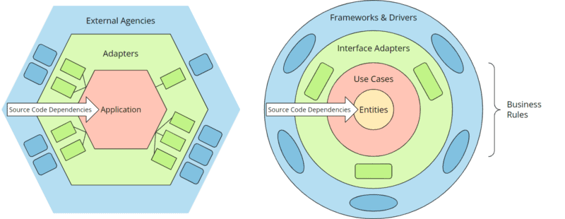

_Kiến trúc lục giác so với kiến trúc sạch_

...

Tóm lại, cả hai kiến trúc gần như giống hệt nhau: phần mềm được chia thành các lớp và tất cả các phụ thuộc mã nguồn đều hướng từ lớp bên ngoài đến lớp bên trong. Lõi của ứng dụng không biết chi tiết về các lớp bên ngoài và chỉ được triển khai dựa trên giao diện của chúng. Điều này tạo ra một hệ thống có các chi tiết kỹ thuật có thể thay thế cho nhau và hoàn toàn có thể kiểm tra được nếu không có chúng.

## Kiến trúc lục giác so với Kiến trúc củ hành

"Kiến trúc củ hành" (the "Onino Architecture") được Jeffrey Palermo trình bày trên blog của mình vào năm 2008, logic nghiệp vụ nằm ở trung tâm, gọi là “lõi ứng dụng”. Phần lõi có các giao diện với giao diện người dùng và cơ sở hạ tầng (cơ sở dữ liệu, hệ thống tệp, hệ thống bên ngoài, v.v.) nhưng không biết về triển khai cụ thể của chúng. Do đó, lõi ở đây cũng bị cô lập khỏi cơ sở hạ tầng.

Cũng giống như trong kiến trúc hình lục giác và kiến trúc sạch, tất cả các phụ thuộc của mã nguồn đều hướng về lõi. Khi hướng cuộc gọi đi ngược lại với phần phụ thuộc mã nguồn, thì việc đảo ngược phụ thuộc sẽ được áp dụng.

Trong hình dưới đây, bạn có thể so sánh kiến trúc lục giác và kiến trúc củ hành:

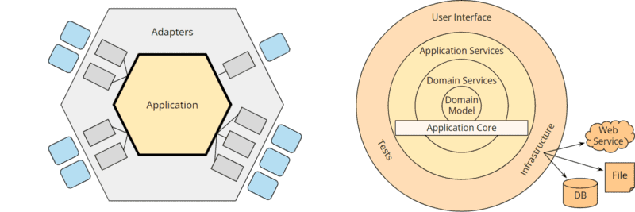

_Kiến trúc lục giác và kiến trúc củ hành_

Nếu chúng ta lại điều chỉnh màu sắc một chút và thay thế giao diện người dùng, các kiểm thử và cơ sở hạ tầng bằng các phần giữ chỗ trong kiến trúc củ hành và ẩn các vòng tùy chọn của lõi ứng dụng, thì chúng ta lại nhận được hai hình ảnh rất giống nhau:

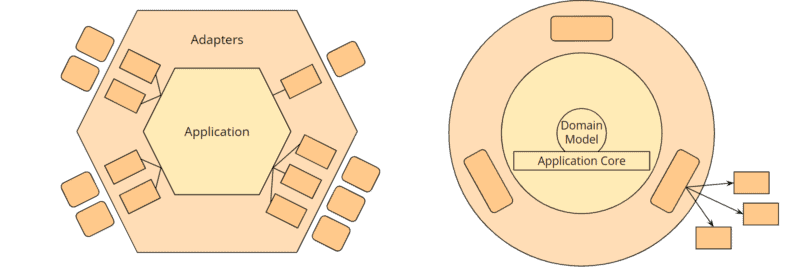

_Kiến trúc lục giác và kiến trúc củ hành (cả hai được “chuẩn hóa”)_

Các hình lục giác có thể được ánh xạ gần như một đối một với các vòng của kiến trúc củ hành.
...
Do đó, cuối cùng thì kiến trúc củ hành cũng gần giống với kiến trúc lục giác – nó chỉ khác ở “mô hình miền” rõ ràng ở trung tâm của lõi ứng dụng.

## Tổng kết

Kiến trúc lục giác hay “cổng và bộ điều hợp” (kiến trúc sạch hoặc kiến trúc củ hành cũng tương tự) là một mẫu kiến trúc giúp loại bỏ các vấn đề của kiến trúc phân lớp truyền thống (rò rỉ chi tiết kỹ thuật sang các lớp khác, khó kiểm thử) và cho phép đưa ra quyết định về chi tiết kỹ thuật (ví dụ: cơ sở dữ liệu được sử dụng) được trì hoãn và thay đổi mà không cần phải điều chỉnh lõi của ứng dụng.

Mã nghiệp vụ nằm trong lõi ứng dụng, duy trì độc lập với mã kỹ thuật trong cơ sở hạ tầng và có thể được phát triển và kiểm thử một cách riêng biệt.

Tất cả các phụ thuộc của mã nguồn đều hướng về lõi. Nguyên tắc đảo ngược phụ thuộc được áp dụng khi luồng điều khiển theo hướng ngược lại, tức là từ lõi đến cơ sở hạ tầng (ví dụ: đến cơ sở dữ liệu).

Mẫu thiết kế hình lục giác đòi hỏi nhiều nỗ lực phát triển hơn và đặc biệt phù hợp với các ứng dụng kinh doanh phức tạp có tuổi thọ dự kiến từ nhiều năm đến nhiều thập kỷ.
