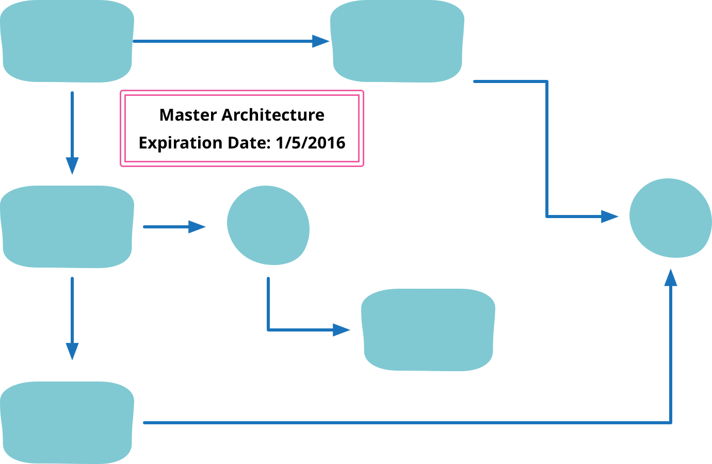

# Kiến trúc hiến tế

Có người nói rằng đọc bài này của Martin Fowler mất 5 phút nhưng dùng được trong 5 năm.
Không thể không dịch bài này của một đại thụ trong ngành thiết kế phần mềm.
[Martin Fowler's Sacrificial Architecture](https://martinfowler.com/bliki/SacrificialArchitecture.html)

Bạn đang ngồi trong một cuộc họp và suy ngẫm về đoạn mã mà nhóm của bạn đã làm việc trong vài năm qua. Bạn đã đi đến quyết định rằng điều tốt nhất bạn có thể làm bây giờ là vứt bỏ tất cả mã đó và xây dựng lại trên một kiến trúc hoàn toàn mới. Điều đó khiến bạn cảm thấy thế nào về đoạn mã bị hủy diệt đó, về thời gian bạn làm việc với nó, về những quyết định bạn đã đưa ra suốt thời gian qua?

Đối với nhiều người, việc vứt bỏ bộ mã là một dấu hiệu của sự thất bại, có lẽ có thể hiểu được do bản chất khám phá vốn có của việc phát triển phần mềm, nhưng vẫn là thất bại.

Nhưng thường thì mã tốt nhất bạn có thể viết bây giờ là mã bạn sẽ loại bỏ sau một vài năm.

Chúng ta thường nghĩ mã tốt là phần mềm tồn tại lâu dài. Tôi đang viết bài này trong một trình soạn thảo có niên đại từ những năm 1980. Nhiều suy nghĩ về kiến trúc phần mềm là làm thế nào để tạo điều kiện cho loại tuổi thọ đó. Tuy nhiên, thành công cũng có thể được xây dựng dựa trên mã đã được gửi tới /dev/null từ lâu.

Hãy xem xét câu chuyện của eBay, một trong những doanh nghiệp lớn thành công nhất trên web. Nó bắt đầu như một tập hợp các tập lệnh Perl được xây dựng vào cuối tuần năm 1995. Vào năm 1997, tất cả đã bị phá bỏ và thay thế bằng một hệ thống được viết bằng C++ trên các công cụ Windows thời đó. Sau đó vào năm 2002, ứng dụng này lại được viết lại bằng Java. Những phiên bản đầu tiên này có phải là lỗi do đã được thay thế không? Khắc nghiệt. Ebay là một trong những thành công lớn nhất của web cho đến nay, nhưng phần lớn thành công đó được xây dựng trên phần mềm bị loại bỏ của những năm 90. Giống như nhiều trang web thành công, ebay đã chứng kiến sự tăng trưởng theo cấp số nhân - và sự tăng trưởng theo cấp số nhân không phù hợp với các quyết định về kiến trúc. Kiến trúc phù hợp để hỗ trợ 1996-ebay sẽ không phải là kiến trúc phù hợp cho 2006-ebay. Phiên bản 1996 sẽ không xử lý được tải của năm 2006 nhưng phiên bản 2006 quá phức tạp để xây dựng, bảo trì và phát triển theo nhu cầu của năm 1996.

Quả thực, hướng dẫn này có thể được áp dụng vào cách thức làm việc của một tổ chức. Tại Google, quy tắc rõ ràng là thiết kế một hệ thống đáp ứng gấp mười lần nhu cầu hiện tại của nó, với ngụ ý rằng nếu nhu cầu vượt quá mức độ lớn thì tốt hơn hết bạn nên vứt bỏ và thay thế lại từ đầu [1]. Việc các hệ thống con được thiết kế lại và loại bỏ sau vài năm là điều bình thường.

Quả thực, đó là một mẫu hình phổ biến khi thấy mọi người tiếp cận với một bộ mã đang trưởng thành và chê bai sự thiếu hiệu suất hoặc khả năng mở rộng của nó. Nhưng thường trong giai đoạn đầu của hệ thống phần mềm, bạn không chắc chắn về những gì nó thực sự cần làm, vì vậy điều quan trọng là phải tập trung nhiều hơn vào tính linh hoạt trong việc thay đổi các tính năng thay vì hiệu suất hoặc tính khả dụng. Sau này, bạn cần thay đổi mức độ ưu tiên khi có nhiều người dùng hơn, nhưng việc có quá nhiều người dùng trên cơ sở mã kém hiệu quả thường là vấn đề tốt hơn so với điều ngược lại. Jeff Atwood đã đặt ra cụm từ "hiệu suất là một tính năng", mà một số người đọc rằng hiệu suất luôn được ưu tiên số 1. Nhưng bất kỳ tính năng nào cũng là thứ bạn phải lựa chọn so với các tính năng khác. Điều đó không có nghĩa là bạn nên bỏ qua những thứ như hiệu suất - phần mềm có thể hoạt động đủ chậm và không đáng tin cậy để giết chết một doanh nghiệp - nhưng nhóm phải thực hiện những đánh đổi khó khăn với các nhu cầu khác. Thường thì đây là những quyết định kinh doanh hơn là những quyết định về công nghệ.

Vậy việc cố tình chọn một kiến trúc hiến tế có ý nghĩa gì? Về cơ bản, điều đó có nghĩa là chấp nhận ngay bây giờ rằng trong một vài năm nữa (hy vọng) bạn sẽ cần phải vứt bỏ những gì bạn đang xây dựng. Điều này có thể có nghĩa là chấp nhận các giới hạn đối với nhu cầu đa chức năng của những gì bạn đang gom góp lại. Điều đó có thể có nghĩa là bây giờ hãy suy nghĩ về những thứ có thể giúp thay thế dễ dàng hơn khi đến lúc - các nhà thiết kế phần mềm hiếm khi nghĩ về cách thiết kế sản phẩm của họ để hỗ trợ sự thay thế nhẹ nhàng của nó. Điều đó cũng có nghĩa là nhận ra rằng phần mềm bị vứt bỏ trong thời gian tương đối ngắn vẫn có thể mang lại nhiều giá trị.

Biết kiến trúc của bạn là phải hy sinh không có nghĩa là từ bỏ chất lượng bên trong của phần mềm. Thông thường, việc hy sinh chất lượng bên trong sẽ khiến bạn tổn hại nhanh hơn thời gian thay thế, trừ khi bạn đang cố gắng loại bỏ bộ mã. Tính mô-đun tốt là một phần quan trọng của một cơ sở mã lành mạnh và tính mô-đun thường giúp ích rất nhiều khi thay thế một hệ thống. Quả thực, một trong những điều tốt nhất nên làm với phiên bản đầu tiên của hệ thống là khám phá cấu trúc mô-đun tốt nhất để bạn có thể xây dựng kiến thức đó cho việc thay thế. Mặc dù việc hy sinh toàn bộ hệ thống trong những ngày đầu có thể là hợp lý, nhưng khi hệ thống phát triển, việc hy sinh các mô-đun riêng lẻ sẽ hiệu quả hơn - điều mà bạn chỉ có thể làm nếu có ranh giới mô-đun tốt.

Một điều dễ bị bỏ qua khi xử lý vấn đề này là kế toán. Vâng, thật đấy - chúng tôi đã gặp phải những tình huống mà mọi người không muốn thay thế một hệ thống rõ ràng là không thể tồn tại được vì cách họ khấu hao bộ mã. Đây có nhiều khả năng là một vấn đề đối với các doanh nghiệp lớn, nhưng đừng quên kiểm tra nó nếu bạn sống trong thế giới đó.

Bạn cũng có thể áp dụng nguyên tắc này cho các tính năng trong hệ thống hiện có. Nếu bạn đang xây dựng một tính năng mới, điều khôn ngoan nhất là chỉ cung cấp tính năng đó cho một nhóm nhỏ người dùng của bạn để bạn có thể nhận được phản hồi về việc liệu đó có phải là một ý tưởng hay hay không. Để làm được điều đó, ban đầu bạn có thể xây dựng nó theo cách hy sinh để không đầu tư toàn bộ công sức vào một tính năng mà bạn thấy không đáng để triển khai đầy đủ.

Khả năng thay thế mô-đun là lập luận chính ủng hộ kiến trúc vi dịch vụ, nhưng tôi thận trọng khuyến nghị điều đó đối với kiến trúc hy sinh. Vi dịch vụ (microservices) ngụ ý sự phân phối và tính không đồng bộ, cả hai đều là yếu tố tăng cường độ phức tạp. Tôi đã gặp một số dự án đi theo con đường microservice mà không thực sự cần thiết — kết quả là làm chậm nghiêm trọng quy trình tính năng của họ. Vì vậy, một thiết kế nguyên khối thường là một kiến trúc hy sinh tốt, với các vi dịch vụ được giới thiệu sau này để dần dần tách nó ra.

Nhóm viết kiến trúc hiến tế là nhóm quyết định đã đến lúc hy sinh nó. Đây là một trường hợp khác với một nhóm mới đến, ghét mã hiện có và muốn viết lại nó. Bạn rất dễ ghét đoạn mã mà bạn không viết ra nếu không hiểu ngữ cảnh mà nó được viết. Cố ý hy sinh mã của riêng bạn là một động lực rất khác và biết rằng bạn sẽ hy sinh mã bạn sắp viết là một biến thể hữu ích của điều đó.

## Lời cảm ơn

Các hội thoại với Randy Shoup đã động viên và giúp tôi hình thành nên bài viết này, đặc biệt những mô tả về lịch sử của eBay (và một vài chuyện tương tự từ Google). Jonny Leroy đã chỉ ra vấn đề kế toán. Keif Morris, Jason Yip, Mahendra Kariya, Jessica Kerr, Rahul Jain, Andrew Kiellor, Fabio Pereira, Pramod Sadalage, Jen Smith, Charles Haynes, Scott Robinson và Paul Hammant đã đưa ra các bình luận hữu ích.

## Ghi chú

1: Như Jeff Dean phát biểu "thiết kế cho tăng trưởng 10 lần, nhưng lập kế hoạch viết lại trước khi mức tăng trưởng đạt 100 lần"
